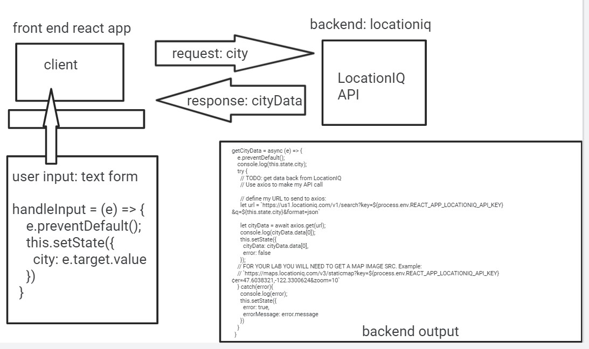
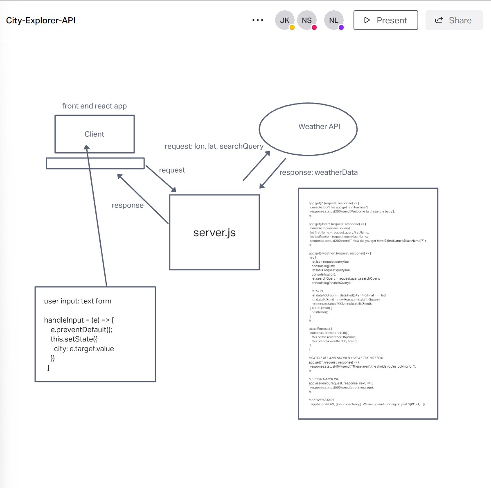
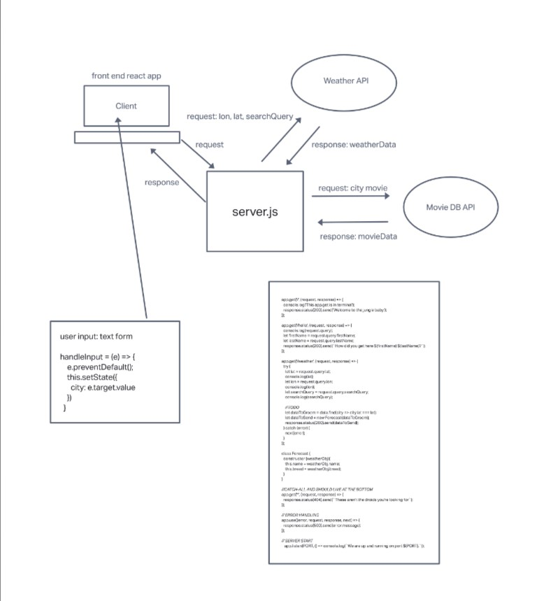
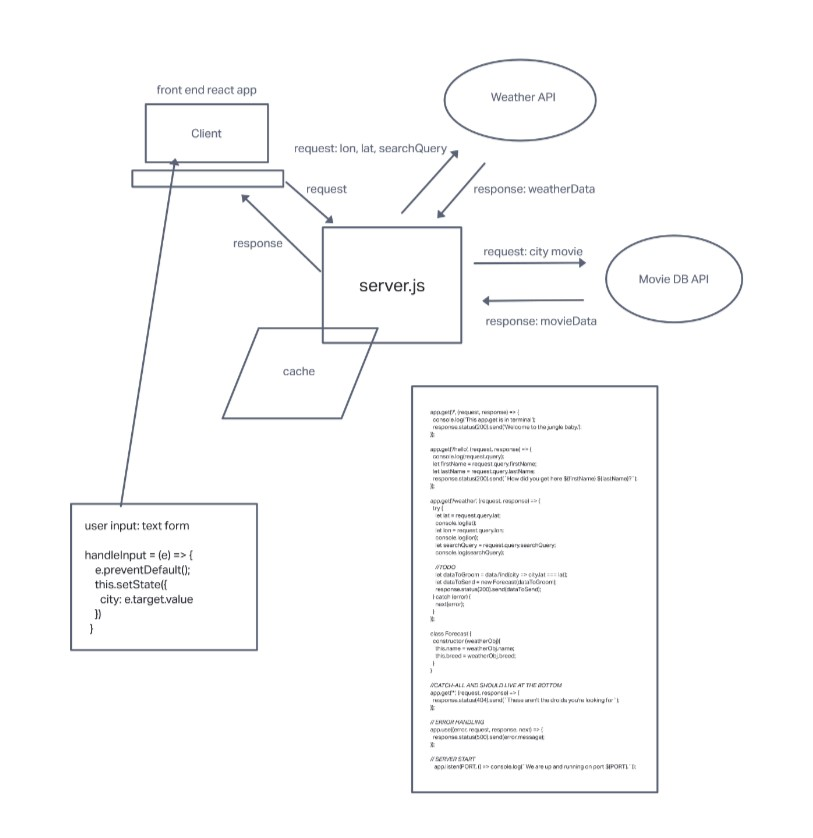

# city-explorer-api

**Author**: Nerissa Leynes
**Version**: 1.0.0 (increment the patch/fix version number if you make more commits past your first submission)

## Overview

We are creating a backend server containing data that we will be using to pass into our front-end. The front-end will be requesting data from our server, and the back-end will send a response to that request. We will be bringing in libraries that will allow these two to communicate to each other.

Modularize the back-end codebase for easy reading and debugging.

## Getting Started

- Create new repo 'city-explorer-api', initialized with README file. Clone the repo to your local machine (on your project directory), and ACP.

- Run the command npm init to create new project and review the package.json file to make sure it is created

- Run the command npm install and make sure to add the following dependencies:
  - express
  - dotenv
  - cors

- Manually add the .gitignore and .eslintrc.json files

- Copy the contents of weather.json and paste it to your local machine/VS code - data/weather.json

## Architecture

Languages, Frameworks, and platforms:

- JavaScript
- React.js
- Bootstrap
- GitHub
- Trello
- Netlify
- Node.js
- Heroku
- Express
- dotenv
- cors

## Change Log

10-26-2022 8:11 pm - Application now has a fully-functional front-end and back-end

10-27-22 12:29am - Application now is sending weather data response to front end

10-27-2022 8:11 pm - The backend are now able to send data to the front-end, getting information from third party API's 'Weatherbit' and 'Movie DB'

10-27-2022 11:15 pm - The back-end codebase has now been modularize for easy reading/debugging

10-29-2022 11:47 pm - the Weather component now has the WeatherData child component. The Movie component also now has a child component

## Credit and Collaborations

Collaborated with my accountability partners, Nick Seidel and Jordan Kwan, in regards to drawing/planning out the WRRC.

WRRC Day 1

WRRC Day 2

WRRC Day 3

WRRC Day 4

## Time Estimates

## LAB 07

### 1. Set up your server repository

Name of feature: *1. Set up your server repository*

Estimate of time needed to complete: 40 min - 1 hour

Start time: 7:36

Finish time: 8:30

Actual time needed to complete: 54 min

### 2. Weather (placeholder): As a user of City Explorer, I want to see weather info for the city I searched, so that I know how to pack for an upcoming trip

Name of feature: *2. Weather (placeholder): As a user of City Explorer, I want to see weather info for the city I searched, so that I know how to pack for an upcoming trip*

Estimate of time needed to complete: 2 hours

1st Day in Lab:

- Start time: 8:40pm

- Finish time: 2:40am

2nd Day in Lab:

- Start time: 7:10pm

- Finish time: 7:50pm

Actual time needed to complete: 6hours 40min

### 3. Errors (revisited): As a user, I want clear messages if something goes wrong so I know if I need to make any changes or try again in a different manner

Name of feature: *3. Errors (revisited): As a user, I want clear messages if something goes wrong so I know if I need to make any changes or try again in a different manner*

Estimate of time needed to complete: 1 hour and 30 min

Start time: 7:36pm

Finish time: 2:40am

Actual time needed to complete: 6hours

## LAB 08

### 1. Weather (live): As a user of City Explorer, I want to see weather info for the city I searched, so that I know how to pack for an upcoming trip

Name of feature: *1. Weather (live): As a user of City Explorer, I want to see weather info for the city I searched, so that I know how to pack for an upcoming trip*

Estimate of time needed to complete: 1 hour and 30 min

1st Day in Lab

- Start time: 8:30pm

- Finish time: 10:00pm

Actual time needed to complete: 1hr 30min

### 2. Movies: As a user of City Explorer, I want to see info about movies related to the city I searched, so that I can learn more about the destination

Name of feature: *2. Movies: As a user of City Explorer, I want to see info about movies related to the city I searched, so that I can learn more about the destination*

Estimate of time needed to complete: 1 hour and 30 min

1st Day in Lab

- Start time: 10:00pm

- Finish time: 2:35am

2nd Day in Lab

- Start time: 5:00pm

- Finish time: 5:37pm

Actual time needed to complete: 5hours+

### 3. Publish: Deploy your server. As a user, I want to access the City Explorer application on the web, so that anyone can explore from anywhere

Name of feature: *3. Publish: Deploy your server. As a user, I want to access the City Explorer application on the web, so that anyone can explore from anywhere*

Estimate of time needed to complete: 1 hour and 30 min

2nd Day in Lab

- Start time: 8:29pm

- Finish time: 8:41pm

Actual time needed to complete: 5hours+

## LAB 09

### 1. Refactor: Modularize the back-end codebase

Name of feature: *1. Refactor: Modularize the back-end codebase*

Estimate of time needed to complete: 30min-1hour

!st Day in Lab

- Start time: 10:45pm

- Finish time: 11:15pm

Actual time needed to complete: 30min

### 2. Refactor: Componentize the front-end codebase

Name of feature: *2. Refactor: Componentize the front-end codebase.*

Estimate of time needed to complete: 30min-1hour

2nd Day in Lab

- Start time: 11:10pm

- Finish time: 11:46pm

Actual time needed to complete: 36min
